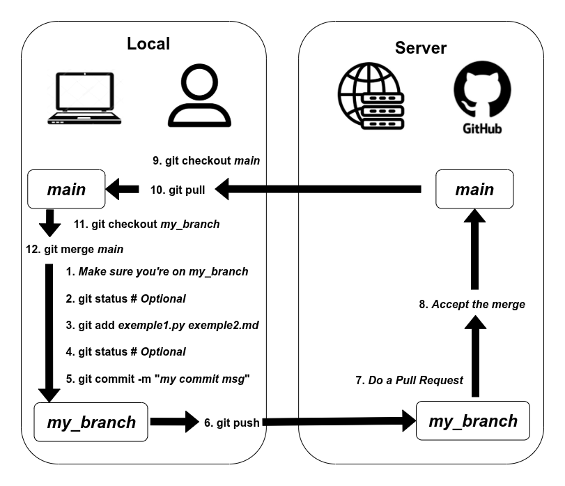

# Hackathon 2025 - Ynov Campus Aix

## Introduction (30mn / 1h) 

Objectif : réaliser un dashboard et un data storytelling sur une thématique au choix à partir 

L’objectif secondaire de ce défi est de vous remettre dans le bain, d’apprendre à vous connaître et à travailler ensemble.

Présentation des ressources et des bonnes pratiques du code avec IA générative.

## Projets

### Sélection (45mn)

Chaque groupe choisit un des projets proposé sur https://defis.data.gouv.fr/ parmi les projets niveau « débutant » ou « intermédiaire »

* chacun-e choisi un projet selon une thématique qui lui plaît
* jetez un œil sur les datas, les objectifs envisageables
* vous avez 2mn pour vous présenter et présenter votre projet aux autres membres de votre groupe
* chacun-e classe les projets en lui donnant une note de 0 à *n - 1* ( *n* = nombre de projets différents proposés)
* on choisit le projet qui remporte le meilleur score

### Prise de connaissance du projet (1h / 1h30)

* Lecture de la page du projet
* Lecture des metadatas, premières explo des données, projets déjà menés (inspi)
* Brainstorming sur une première définition de l’objectif (pensez déjà maquette de dashboard)
* Répartition des rôles (explo / documentation / analyses ou modèles / front)
* Mise en place d’un environnement virtuel
* Mise en place d’un dépôt GitHub / GitLab, collaboration
* Mise en place d’un outil de suivi de projet (Trello, whiteboard, etc.) - inutile de passer trop de temps -> faîtes des points réguliers

## À vos IDE ! (le reste des 48h)

## Démos (vendredi 16h)

## Conseil et ressources

N’hésitez pas à mettre à profit les ressources pédagogiques proposées sur la page des défis, ou à relire vos cours (quelques liens ci-dessous).

Voici également quelques liens qui vous seront utile pour organiser un projet si vous avez oublié (environnements virtuels, bonne pratiques, git, etc.)

### Organiser un projet

* [Cours sur les environnement virtuels](https://filedn.eu/lefeldrXcsSFgCcgc48eaLY/lecons/lecon_environnements_virtuels.slides.html#/)
* Vous avez fait des bêtises avec Git : https://ohshitgit.com/
* Vous ne maîtrisez pas Git ? [Git it !](https://github.com/Git-it-App/) (mais pas pendant ces 48h)
* Les commandes git qui vous seront utiles (révisez dans la [doc](https://git-scm.com/docs)):
  * git status
  * git pull
  * git push
  * git add
  * git commit
  * git branch
  * git checkout
  * git stash 

* Rappel sur le flux de travail avec git (illustration de Virgile Pesce) : 

### GenIA et data-science

* [Une introduction aux bonnes pratiques dans l’utilisation de la GenIA](./GenAI-Data-Science.md)

### Cours

* [Bases de numpy et pandas](https://github.com/virgilus/science-des-donnees) par Virgile Pesce (on ne sait jamais)
* [EDA (B3)](https://github.com/Jehadel/EDA-cours/tree/main)

* [EDA plus condensé (anglais)](https://github.com/Jehadel/EDA-courses)

* [Dataviz : geospatial et dash](https://github.com/Jehadel/DataViz-cours)